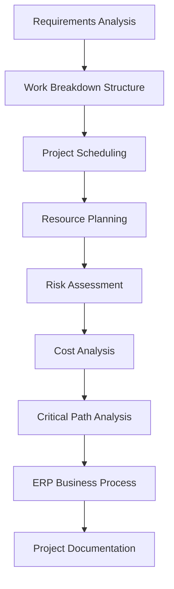

# ERP CRM Implementation Project

## Overview

This project presents the planning and management of a CRM system implementation using **Microsoft Project** and business process concepts based on **Comarch ERP Optima**.

Originally developed as part of a university project, it was further expanded into a portfolio project demonstrating ERP implementation planning, project management, resource planning, and business process analysis.

The project covers the complete planning phase of a CRM implementation, from requirements analysis to project scheduling, resource allocation, risk assessment, cost analysis, and ERP-supported business process modelling.

---

## Objectives

- Plan a complete CRM implementation project
- Create a Work Breakdown Structure (WBS)
- Develop a project schedule using Microsoft Project
- Allocate project resources
- Perform project risk assessment
- Estimate project costs
- Identify the Critical Path
- Model ERP-supported business processes

---

## Technologies & Tools

| Category | Technologies |
|----------|--------------|
| ERP | Comarch ERP Optima |
| Project Management | Microsoft Project |
| Planning | Work Breakdown Structure (WBS), Gantt Chart, Critical Path Method (CPM) |
| Analysis | Resource Planning, Risk Assessment, Cost Analysis |
| Documentation | Markdown, GitHub |

---

## Key Features

- Project planning based on the ERP implementation lifecycle
- Work Breakdown Structure (WBS)
- Project schedule with task dependencies
- Resource allocation and workload analysis
- Critical Path analysis
- Cost estimation and reporting
- Risk identification and mitigation planning
- ERP business process modelling

---

## Project Workflow



---

## Quick Links

- 📄 [Documentation](#documentation)
- 📁 [Project Files](#project-files)
- 📸 [Screenshots](#screenshots)
- 💼 [Skills Demonstrated](#skills-demonstrated)

---

## Documentation

- 📄 [Project Overview](docs/project-overview.md)
- 📄 [Project Planning](docs/project-planning.md)
- 📄 [ERP Business Process](docs/erp-business-process.md)
- 📄 [Lessons Learned](docs/lessons-learned.md)

---

## Project Files

- 📁 [Microsoft Project Schedule](ms-project/CRM_Implementation.mpp)
- 📄 [Project Report (PDF)](report/university-project-report.pdf)
  
---

## Screenshots

Selected Microsoft Project screenshots are available in the [screenshots](screenshots/) directory.

The folder includes:

- Gantt Chart Overview
- Critical Path Analysis
- Resource Sheet
- Resource Utilization
- Resource Report
- Task Cost Overview

➡️ Open the folder: [screenshots](screenshots/)

---

## Repository Structure

```text
erp-crm-implementation-project
│
├── README.md
│
├── docs
│   ├── project-overview.md
│   ├── project-planning.md
│   ├── erp-business-process.md
│   └── lessons-learned.md
│
├── ms-project
│   └── CRM_Implementation.mpp
│
├── report
│   └── project-report.pdf
│
└── screenshots
    ├── README.md
    ├── gantt-chart-overview.png
    ├── critical-path.png
    ├── resource-sheet.png
    ├── resource-graph.png
    ├── resource-report.png
    └── task-cost-overview.png
```

---

## Skills Demonstrated

- ERP implementation planning
- Project scheduling
- Work Breakdown Structure (WBS)
- Resource management
- Critical Path Method (CPM)
- Business process analysis
- Risk assessment
- Cost estimation
- Microsoft Project
- Technical documentation using Markdown and GitHub

---

## License

This repository is published for educational and portfolio purposes.
