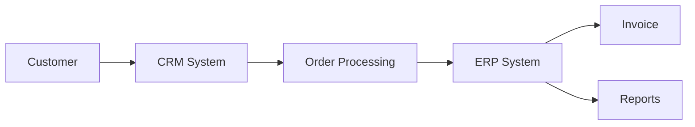

# ERP Business Process

## Overview

This project models a business process supported by an ERP system using **Comarch ERP Optima**. The objective was to demonstrate how a CRM implementation can improve information flow, support business operations, and increase process efficiency.

For information about project planning, see the [Project Planning](project-planning.md).

---

## Process Workflow

The implemented workflow includes the following stages:

1. Customer request
2. Sales opportunity registration
3. Customer data management
4. Order processing
5. Invoice generation
6. Reporting and analysis

The process ensures that business information is collected, processed, and shared across the organization.

---

## ERP System Support

The ERP system supports the process by:

- centralizing customer information,
- managing sales activities,
- automating business processes,
- improving data accuracy,
- generating reports for decision-making.

---

## Business Benefits

Implementing an ERP-supported CRM process provides several advantages:

- improved operational efficiency,
- faster access to business information,
- better customer relationship management,
- reduced manual work,
- improved reporting and data consistency.

---

## Process Diagram

## Summary

ERP systems integrate business processes into a single environment, enabling organizations to improve communication, automate routine activities, and support informed business decisions.

For project outcomes and key takeaways, see the [Lessons Learned](lessons-learned.md).
